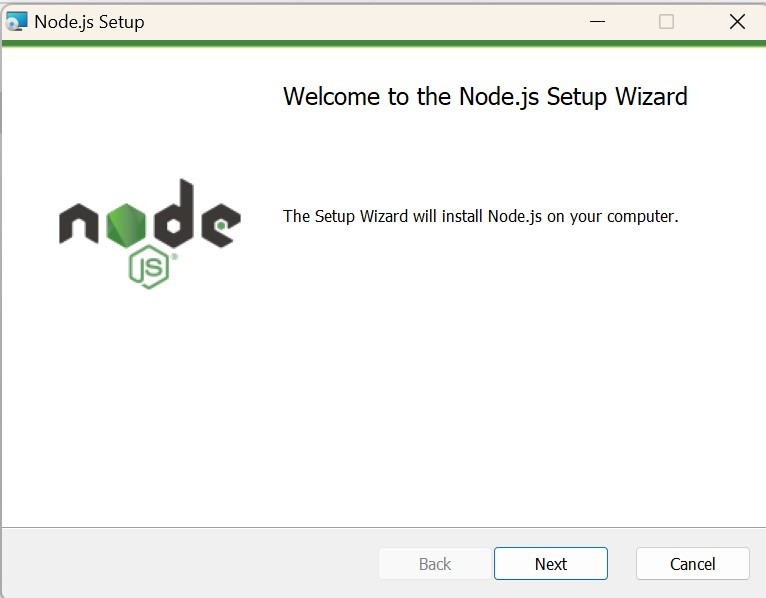
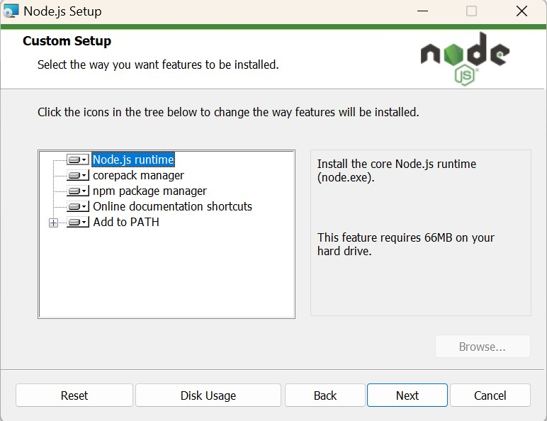

# Fronend Angular with Node backend

## Installation

### Nodejs

[nodejs Download link](https://nodejs.org/en/download/prebuilt-installer)

Version : v20.15.0 (LTS)

Step1:


Step2:


Step:3


Step:4


Step5:


Step6:


Step7:


Step8:


Step9: Check node version after install in cmd / Powershell 

````cmd
node -v
````


## Project Setup

### Node backend

Step 1: Create backend node project for student record management
````cmd
cd c:\node-sample\sample-api\backend\
mkdir student-record-mgnt-api
````

Step 2: init
````cmd
cd c:\node-sample\sample-api\backend\student-record-mgnt-api
npm init
````


*   Note:
1. package name: (student-record-mgnt-api)
2. version: (1.0.0)
3. description: Student record management api
4. entry point: (index.js) app.js
5. test command: npm test
6. git repository: 
7. keywords:
8. author: arun
9. license: (ISC)
10. Is this OK? (yes) 

Step 3: Install Express and other dependencies
````cmd
c:\node-sample\sample-api\backend\student-record-mgnt-api
npm install express
````

Step 4: Create app.js file
````cmd
c:\node-sample\sample-api\backend\student-record-mgnt-api
cd . > app.js
````

Step 5: Refer app.js file content  

Step 6: Run the api

````cmd
c:\node-sample\sample-api\backend\student-record-mgnt-api
node app.js
````

Step 7: Open browser and hit http://localhost:3000/status 


### vs code plugin

````
https://marketplace.visualstudio.com/items?itemName=dbaeumer.vscode-eslint

https://marketplace.visualstudio.com/items?itemName=esbenp.prettier-vscode

https://marketplace.visualstudio.com/items?itemName=rodrigovallades.es7-react-js-snippets

https://marketplace.visualstudio.com/items?itemName=xabikos.ReactSnippets

https://marketplace.visualstudio.com/items?itemName=alefragnani.Bookmarks

https://marketplace.visualstudio.com/items?itemName=formulahendry.auto-close-tag

https://marketplace.visualstudio.com/items?itemName=formulahendry.auto-rename-tag

https://marketplace.visualstudio.com/items?itemName=wix.vscode-import-cost

````
### React Frontend 

Step 1: Install npx 

````cmd
npm install -g npx
````

Step 2: Create React project  

````cmd

c:\node-sample\sample-api\frontend\
npx create-react-app student-record-mgnt-ui
cd student-record-mgnt-ui
npm start

````

Step 3: install react dom  
````cmd
npm install react-router-dom --save
````
